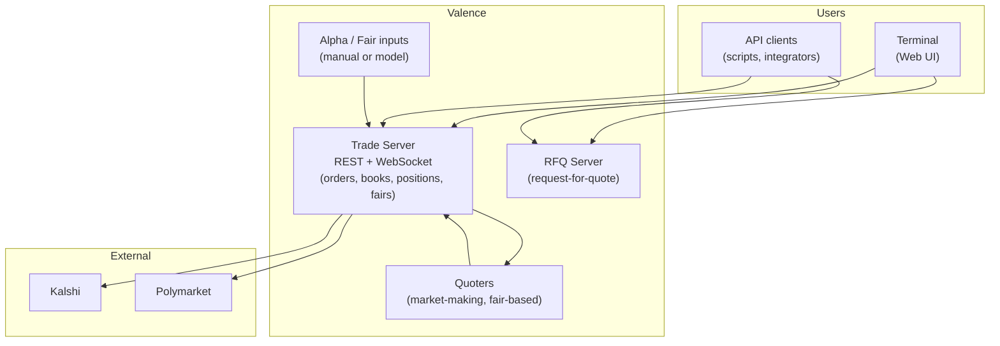

This page describes the main components of Valence and how they connect.

## Architecture diagram

- **Terminal** — The Valence web UI. It talks to the Trade Server (REST + WebSocket) for orders, books, positions, and fair values, and to the RFQ Server for block RFQ flows.
- **Trade Server** — Core API: auth, orders, order books, positions, fair values, market data. Streams books, orders, and fairs over WebSocket. Connects to exchanges (e.g. Kalshi, Polymarket) to place and cancel orders and to stream market data.
- **RFQ Server** — Request-for-quote service for block or structured trades (separate port).
- **Quoters** — Automated market-making strategies that quote based on fair values and spread logic. They consume fairs from the Trade Server and send orders through it.
- **Alpha / Fair inputs** — Fair values can come from a model (alpha bus), manual input via `POST /api/fair`, or a combination. The Trade Server distributes them to quoters and to the Terminal.

## Data flow

1. **Fair values** — Published to the Trade Server (alpha bus or `POST /api/fair`). Streamed to the Terminal and used by Quoters to compute bid/ask levels.
2. **Orders** — Placed via the Trade Server (Terminal or API). The server routes them to the appropriate exchange. Quoters also send orders through the Trade Server.
3. **Market data** — Order books and executions are streamed from the Trade Server over WebSocket to the Terminal and to API clients.

For base URLs and authentication, see [API overview](/api/overview).
